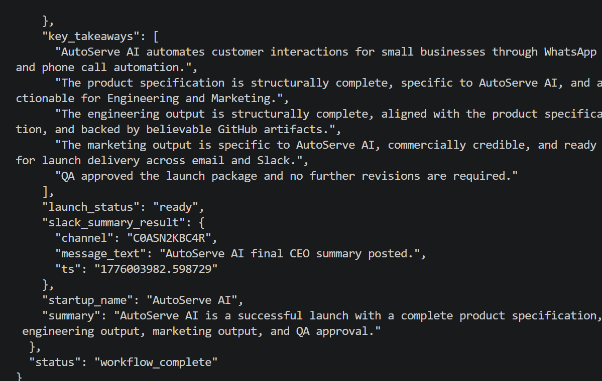
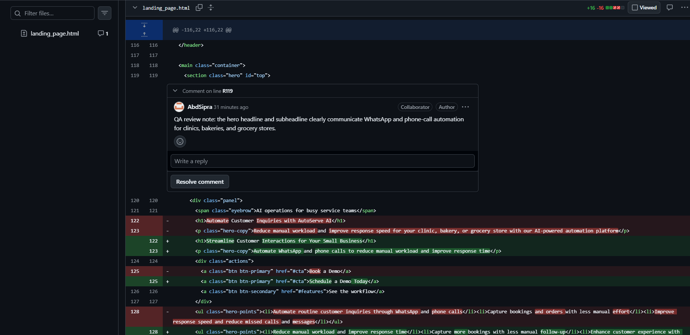
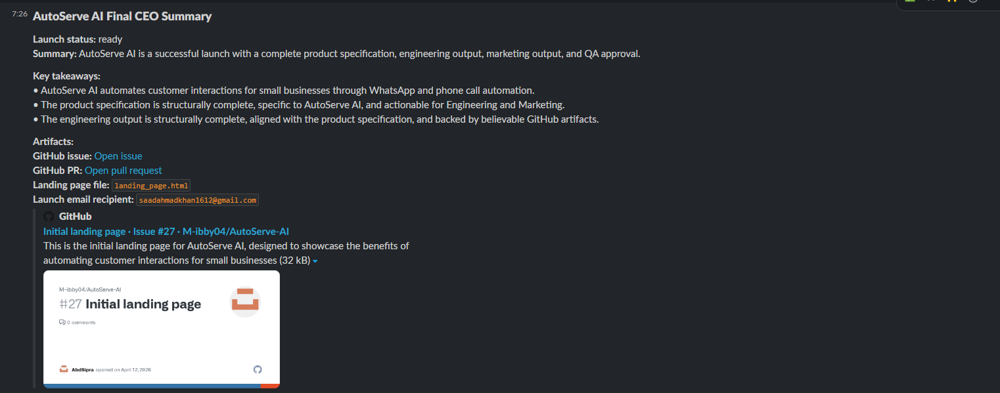
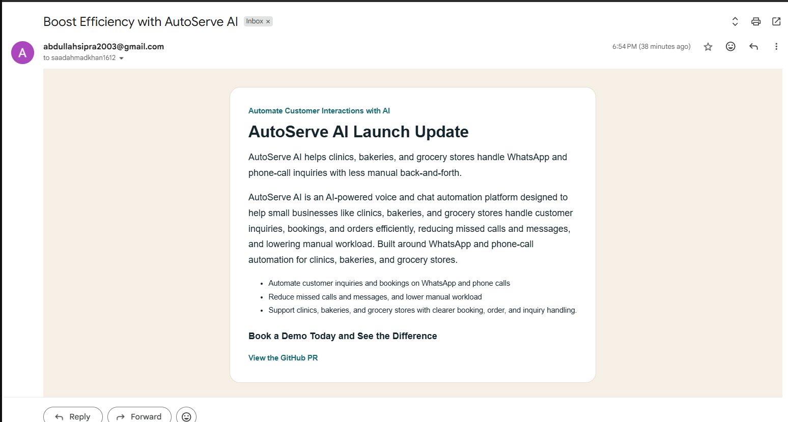

# LaunchMind: AutoServe AI Multi-Agent System

AutoServe AI is a LaunchMind assignment project that simulates a micro-startup using a real Python multi-agent system. The system takes a startup idea, routes structured JSON messages through a shared in-memory message bus, generates startup assets with LLM reasoning, creates GitHub artifacts, sends a real email, posts to Slack, and uses a QA-driven revision loop before the CEO finalizes the launch summary.

## Startup Context

- Startup name: AutoServe AI
- Core product: AI-powered WhatsApp and phone-call automation for small businesses
- Target users: clinics, bakeries, grocery stores, and similar service teams
- Main jobs: customer inquiries, bookings, and order handling
- Business value: fewer missed calls/messages, faster responses, and reduced manual workload

## Project Structure

```text
assets/
  screenshots/
    email-proof.png
    qa-inline-comments.png
    slack-ceo-summary.png
    workflow-summary-output.png
agents/
  ceo_agent.py
  product_agent.py
  engineer_agent.py
  marketing_agent.py
  qa_agent.py
scripts/
  run_engineer_smoke_test.py
utils/
  llm.py
  github_api.py
  slack_api.py
  email_api.py
main.py
message_bus.py
requirements.txt
.env.example
.gitignore
README.md
```

## Architecture Overview

### Message Bus

`message_bus.py` provides the official communication layer. Every inter-agent message is a JSON-serializable Python dictionary with:

```json
{
  "message_id": "uuid",
  "from_agent": "ceo|product|engineer|marketing|qa",
  "to_agent": "ceo|product|engineer|marketing|qa",
  "message_type": "task|result|revision_request|confirmation|failure",
  "payload": {},
  "timestamp": "ISO-8601 UTC string",
  "parent_message_id": "optional"
}
```

The bus stores full history, supports per-agent unread retrieval, and can print the full message log for demo use.

### Agents

- CEO Agent: orchestrates the workflow, decomposes work with the LLM, reviews outputs, requests revisions, keeps a decision log, produces the final summary, and posts the final launch summary to Slack.
- Product Agent: creates the AutoServe AI product spec, handles revisions with feedback and previous context, previews the spec to downstream agents, and sends the reviewable result to the CEO.
- Engineer Agent: generates the landing page HTML/CSS, writes `landing_page.html`, creates the GitHub issue, branch, commit, and PR, and returns structured engineering output to the CEO.
- Marketing Agent: generates startup-specific messaging, sends a real email, posts a Slack Block Kit launch message, and returns structured launch-copy results to the CEO.
- QA Agent: reviews engineering and marketing outputs against the product spec, returns a pass/fail report, and posts inline PR review comments on `landing_page.html` as part of the QA feedback loop.

## Workflow

1. `main.py` starts with the AutoServe AI startup idea.
2. CEO uses the LLM to create a structured Product task.
3. Product generates the spec and sends it to the CEO for review.
4. CEO either approves the spec or sends a revision request.
5. After approval, CEO sends the task to Engineer.
6. Engineer generates the landing page and creates real GitHub artifacts.
7. CEO reviews engineering output and either approves it or requests changes.
8. Once engineering is approved, CEO sends the task to Marketing with PR context.
9. Marketing sends a real email and posts the Slack launch announcement.
10. CEO reviews marketing output and either approves it or requests changes.
11. QA reviews engineering and marketing outputs together.
12. If QA fails the package, CEO sends revision requests to Engineer and/or Marketing.
13. If QA passes, CEO generates the final structured launch summary and posts it to Slack.

This creates a real review-and-revision loop rather than a rigid fixed pipeline.

## Environment Variables

Copy `.env.example` to `.env` and fill in the real values.

### LLM

- `OPENAI_API_KEY`
- `LLM_API_KEY` as fallback
- `LLM_BASE_URL`
- `LLM_MODEL`
- `LLM_TIMEOUT`
- `LLM_MAX_RETRIES`
- `LLM_TEMPERATURE`
- `DEBUG_LLM`

### GitHub

- `GITHUB_TOKEN`
- `GITHUB_REPO` in `owner/repo` format
- `GITHUB_API_BASE_URL`
- `GITHUB_TIMEOUT`
- `GITHUB_MAX_RETRIES`
- `GITHUB_COMMIT_AUTHOR_NAME`
- `GITHUB_COMMIT_AUTHOR_EMAIL`
- `GITHUB_COMMITTER_NAME`
- `GITHUB_COMMITTER_EMAIL`

### Slack

- `SLACK_BOT_TOKEN`
- `SLACK_CHANNEL` can be a channel ID like `C12345678`, a name like `launches`, or `#launches`
- `SLACK_API_BASE_URL`
- `SLACK_TIMEOUT`
- `SLACK_MAX_RETRIES`

### Email

Primary option:

- `SENDGRID_API_KEY`
- `VERIFIED_SENDER_EMAIL` or `FROM_EMAIL`
- `TEST_RECIPIENT_EMAIL`
- `EMAIL_TIMEOUT`
- `EMAIL_MAX_RETRIES`

SMTP fallback option:

- `SMTP_HOST`
- `SMTP_PORT`
- `SMTP_USERNAME`
- `SMTP_PASSWORD`
- `SMTP_USE_TLS`

### Optional

- `STARTUP_IDEA` if you want to override the default AutoServe AI idea

## Setup

1. Create a Python virtual environment.
2. Install dependencies:

```bash
pip install -r requirements.txt
```

3. Copy the environment template:

```bash
cp .env.example .env
```

On Windows PowerShell, you can use:

```powershell
Copy-Item .env.example .env
```

4. Fill in the required real tokens, repo name, sender email, and recipient inbox.

## How to Run

Run the default AutoServe AI workflow:

```bash
python main.py
```

Or provide a startup idea override from the command line:

```bash
python main.py "Your alternate startup idea here"
```

### Engineer Smoke Test

Preview the Engineer Agent locally without creating GitHub artifacts:

```bash
python scripts/run_engineer_smoke_test.py --write-html
```

Publish the Engineer Agent flow to GitHub:

```bash
python scripts/run_engineer_smoke_test.py --publish
```

If you need to update the existing landing-page PR instead of creating new artifacts, reuse the original issue/PR/branch:

```bash
python scripts/run_engineer_smoke_test.py --publish --reuse-issue-number 1 --reuse-issue-url "https://github.com/M-ibby04/AutoServe-AI/issues/1" --reuse-pr-number 2 --reuse-pr-url "https://github.com/M-ibby04/AutoServe-AI/pull/2" --reuse-branch landing-page
```

## Demo Output

The terminal run is designed to show:

- each major agent step
- each review decision by the CEO
- revision requests when needed
- GitHub artifact creation
- Slack posting
- email sending
- final CEO summary
- full message log

## External Integration Notes

### GitHub

The Engineer Agent uses the GitHub REST API to:

- create an issue
- create or reuse a branch
- commit `landing_page.html`
- open a pull request

The QA Agent can post PR review comments or fallback PR comments through the same API.

### Slack

The Marketing Agent posts to Slack using `chat.postMessage` with Block Kit sections. The launch message includes the tagline, one-line launch summary, and the GitHub PR link.
If the PR URL is temporarily unavailable, the Slack message falls back to a clear "PR pending" note instead of crashing the workflow.

### Email

The Marketing Agent sends a real email using SendGrid if `SENDGRID_API_KEY` is configured. If SendGrid is not configured, it falls back to SMTP credentials.

## Evidence

Verified evidence from the final AutoServe AI workflow run:

- GitHub issue URL: `https://github.com/M-ibby04/AutoServe-AI/issues/24`
- GitHub PR URL: `https://github.com/M-ibby04/AutoServe-AI/pull/8`
- QA inline PR comment evidence: `https://github.com/M-ibby04/AutoServe-AI/pull/8/changes/8c304b557cb1aa812769b544f68b5813f027d5df`
- Slack marketing launch evidence: captured in the submitted Slack screenshot
- Slack CEO final summary evidence: captured in the submitted Slack screenshot
- Slack CEO final summary timestamp: `1776003982.598729`
- Email delivery evidence: captured in the submitted inbox screenshot

### Evidence Screenshots

#### Final Workflow Summary Output



#### QA Inline PR Comments On PR #8



#### CEO Final Slack Summary



#### Email Delivery Proof



## Notes

- The code is written to be API-ready and use real platform actions, not mocks.
- The project expects valid external credentials before the full workflow can succeed.
- `landing_page.html` is generated at runtime in the repository root and is also committed to GitHub through the Engineer Agent.
